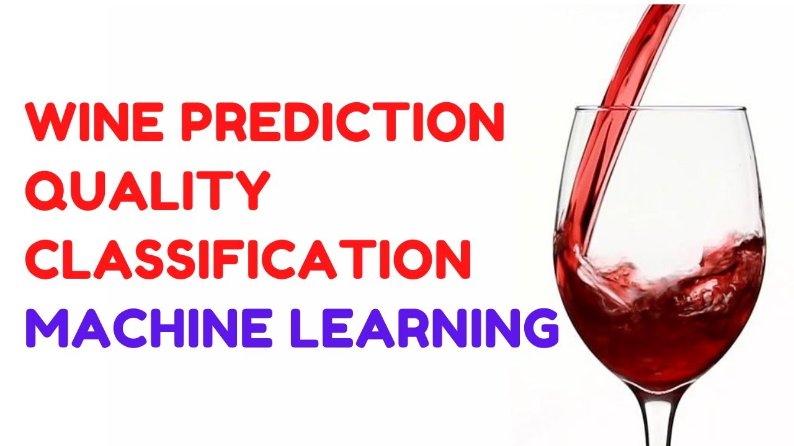

# End-to-end-ML-Project-Implementation

## Red wine quality classification


## Workflows

1. update config.yaml
2. update schema.yaml
3. update params.yaml
4. update the entity 
5. update the configuration manager in src config
6. update the components
7. update the pipeline
8. update the main.py
9. update the app.py


# How to run?
### STEPS:

Clone the repository

```bash
https://github.com/highfrezh/End-to-end-ML-Project-Implementation.git
```
### STEP 01- Create a conda environment after opening the repository

```bash
conda create -n mlproj python=3.8 -y
```

```bash
conda activate mlproj
```


### STEP 02- install the requirements
```bash
pip install -r requirements.txt
```


```bash
# Finally run the following command
python app.py
```

Now,
```bash
open up you local host and port
```
